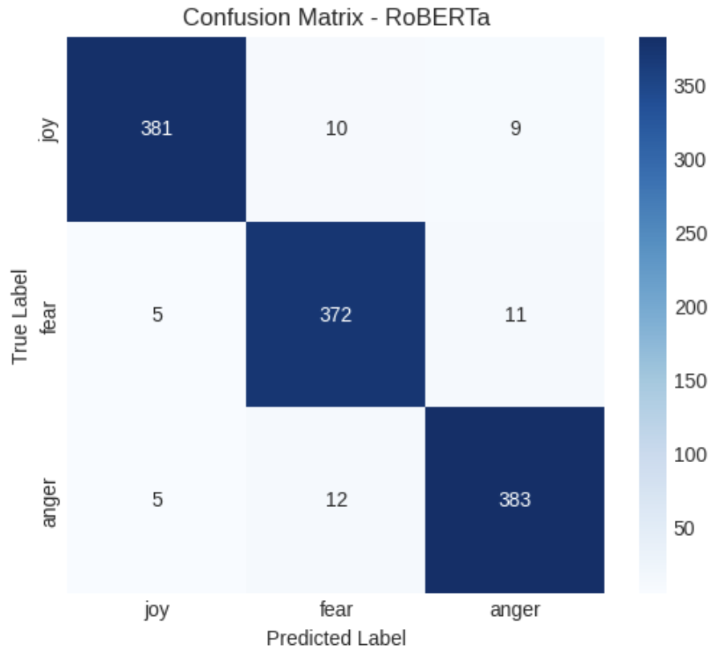

# An Exploratory Analysis of Emotion Detection Methods Across Diverse Text Types

## 📝 Overview

This repository contains the code and findings from my undergraduate thesis, which explores the performance of various machine learning and deep learning models for emotion detection. The primary goal was to analyze how different text characteristics—such as short and informal tweets, narrative blog comments, and context-dependent film dialogues—impact model performance.

This study compares seven models:
* **Machine Learning**: Naïve Bayes, Support Vector Machine (SVM), Random Forest
* **Deep Learning**: BiLSTM, BERT, RoBERTa, DistilBERT
  
---

## 📊 Datasets

This research utilizes five publicly available datasets for emotion classification:

1.  **"Emotions" by Elgiriyewithana**: [Link to Kaggle Dataset](https://www.kaggle.com/datasets/nelgiriyewithana/emotions)
2.  **"Emotion Dataset" by Parul Pandey**: [Link to Kaggle Dataset](https://www.kaggle.com/datasets/parulpandey/emotion-dataset)
3.  **"ISEAR" by Faisal Santo**: [Link to Kaggle Dataset](https://www.kaggle.com/datasets/faisalsanto007/isear-dataset/data)
4.  **"Emotion Dataset" by Abdallah Wagih**: [Link to Kaggle Dataset](https://www.kaggle.com/datasets/abdallahwagih/emotion-dataset)
5.  **MELD (Multimodal EmotionLines Dataset)**: [Project Website](https://affective-meld.github.io/)

*Due to their size, the datasets are not uploaded to this repository. Please download them from the links provided.*

---

## ⚙️ Methodology

The project workflow is divided into several steps, as detailed in the Jupyter notebooks:

1.  **Data Exploration**: Initial analysis to understand the distribution of emotions and text characteristics.
2.  **Data Preprocessing**: Cleaning the text data, including lowercasing, stopword removal, and tokenization.
3.  **Data Splitting**: Splitting data 80 training 20 testing for data that have no splitting from the source.
4.  **Feature Extraction**: Converting text into a numeric form that can be understood by the model.
5.  **Model Training & Evaluation**: Implemented and compared several models, such as LSTM, Bidirectional LSTM, and BERT. The models were evaluated using metrics like Accuracy, Precision, Recall, and F1-Score.
6.  **Result Visualization (`04_result_visualization.ipynb`)**: Visualizing model performance through confusion matrices and accuracy plots.

---
## 📊 Key Findings & Results

The research confirms that there is no single best approach for all conditions. The optimal choice of model heavily depends on the data characteristics and the trade-off between accuracy and computational efficiency.

### Overall Performance Summary

Deep learning models based on the Transformer architecture consistently achieved the highest accuracy, especially on tweet and comment datasets. However, traditional machine learning models offered significantly faster inference times.

| Dataset Type      | Best Model (Accuracy) | Top F1-Score | Fastest Model (Inference) |
| ----------------- | --------------------- | ------------ | ------------------------- |
| **Tweets** | RoBERTa / BERT        | 0.93 / 0.87  | Naive Bayes (0.001s)      |
| **Comments** | RoBERTa               | **0.96** | Naive Bayes (0.001s)      |
| **Dialogues (MELD)** | BERT / RoBERTa        | 0.29 / 0.27  | Naive Bayes (0.001s)      |

*(This summary is derived from Tables 4.13, 4.14, and 4.15 in the thesis).*


_**Figure 1:** Confusion matrix for RoBERTa on the comment dataset, achieving the highest F1-score of 0.96._

### The Challenge of Context: Dialogue Data

A major finding was the significant performance drop across **all models** on the MELD dialogue dataset. The highest F1-score was a mere **0.29 (BERT)**. This highlights the limitation of single-sentence analysis, as the models failed to capture the conversational context necessary to interpret emotions accurately.

### The Surprising Impact of Preprocessing

An additional experiment revealed a fascinating trade-off regarding text preprocessing:

* **For Machine Learning Models**: Preprocessing (stemming, stopword removal, etc.) was crucial and significantly improved performance.
* **For Deep Learning Models**: On context-rich dialogue data (MELD), **removing preprocessing significantly boosted performance**. RoBERTa's F1-score, for example, jumped from **0.27 to 0.45**. This suggests that preprocessing can strip away important contextual clues that Transformer models are designed to understand.

| Model     | F1-Score on MELD (With Preprocessing) | F1-Score on MELD (Without Preprocessing) |
| --------- | ------------------------------------- | ---------------------------------------- |
| BERT      | 0.29                                  | **0.43** |
| RoBERTa   | 0.27                                  | **0.45** |
| DistilBERT| 0.25                                  | **0.42** |

*(Data from Table 4.20 in the thesis).*

---
## 🏛️ Project Structure
The repository is structured as follows:

```
Exploring Emotion Recognition Techniques for Text from Twitter, Blog Comments, and Movie Dialogue/
├── notebooks/    # Jupyter notebooks for each dataset
├── results/      # Figures, tables, and other outputs
└── README.md     # Project overview
```

---

## 🚀 Notebooks & Implementation
The complete implementation, analysis, and visualization for each dataset can be accessed directly through the following online notebooks:

1.  **"Emotions" by Elgiriyewithana**: [Link to notebook](https://www.kaggle.com/code/hilqudz/emotionssss)
2.  **"Emotion Dataset" by Parul Pandey**: [Link to notebook](https://www.kaggle.com/code/hilqudz/zip-dataset)
3.  **"ISEAR" by Faisal Santo**: [Link to notebook](https://colab.research.google.com/drive/1EW7uu9XOTzgU5QhmS6TRN9U76pRaIHHv?usp=sharing)
4.  **"Emotion Dataset" by Abdallah Wagih**: [Link to notebook](https://colab.research.google.com/drive/1xnLPPszFoIRGZXVlxf1eYRsePCqE6-00?usp=sharing)
5.  **MELD (Multimodal EmotionLines Dataset)**: [Link to notebook](https://www.kaggle.com/code/hilqudz/melddd-ok)

---
